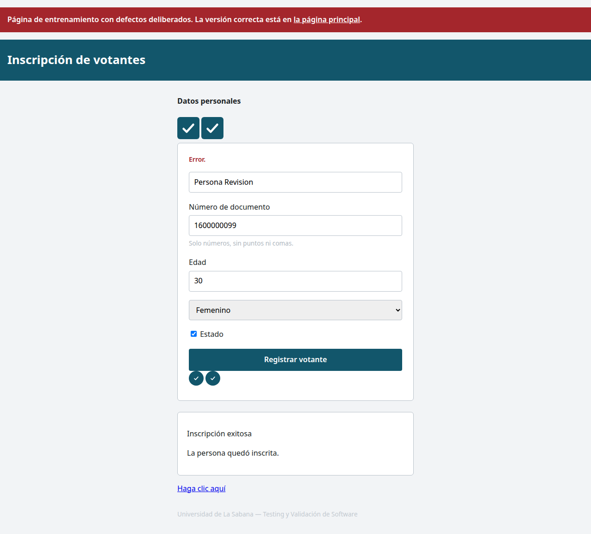

# Accesibilidad: auditoría y revisión asistida

## Medición ejecutada

Se ejecutó axe-core 4.13.0 con Chromium sobre el estado inicial, los errores de validación y una inscripción exitosa de `index.html`. Cada estado tuvo cero violaciones con el filtro `wcag2a`, `wcag2aa`, `wcag21a`, `wcag21aa`. Los JSON incluyen también comprobaciones que axe dejó para revisión; cero violaciones no certifica accesibilidad completa.

Sobre `/defectuosa.html`, el filtro reportó seis reglas; sin filtro aparecieron diez. Las cuatro adicionales son buenas prácticas de axe que ese filtro omite. Son reglas, no un conteo de nodos ni de participantes excluidos.

| Regla | Con filtro WCAG | Quién puede quedar excluido y por qué |
|---|---|---|
| button-name | Sí | Quien usa lector de pantalla no puede saber para qué sirve el botón de ayuda sin nombre. |
| color-contrast | Sí | Una persona con baja visión puede no distinguir la ayuda y el pie sobre su fondo. |
| html-has-lang | Sí | Un lector de pantalla no recibe el idioma del documento y puede pronunciar el español incorrectamente. |
| image-alt | Sí | Quien no ve la imagen pierde la información que esa imagen aporta. |
| link-name | Sí | Quien navega por la lista de enlaces no sabe el destino o propósito del enlace sin nombre. |
| select-name | Sí | El selector de género no comunica qué dato debe elegir quien usa lector de pantalla. |
| heading-order | No | Los saltos de encabezados dificultan reconstruir la jerarquía mediante un lector de pantalla. |
| landmark-one-main | No | Falta la región principal que permite saltar a la tarea sin recorrer toda la pantalla. |
| region | No | Parte del contenido queda fuera de regiones semánticas usadas para orientarse y navegar. |
| tabindex | No | El orden artificial de tabulación obliga a quien usa teclado a recorrer campos en una secuencia inesperada. |

### Regla priorizada del grupo B

Se prioriza **tabindex**: en la página defectuosa, Edad tiene índice 1, Documento 2 y Nombre 3, lo que fuerza un orden diferente del orden visual y de la tarea. Afecta directamente a quien navega con teclado. La ausencia de `<main>` también dificulta la orientación, pero el orden de tabulación altera cada recorrido de los campos. Esta elección es una priorización técnica de la entrega, no una medición de prevalencia.

## Grupo C: guía de revisión manual asistida

La revisión se realizó con asistencia de IA, inspeccionando los estados del navegador y el DOM. Se consultó el material del profesor antes de esta comprobación: **no se presenta como una búsqueda a ciegas del estudiante**. No se ejecutó una sesión con lector de pantalla real. La evidencia está en [revision-asistida.json](../evidencias/revision-asistida.json) y en la captura siguiente.

| Defecto | Ubicación | Por qué axe no lo reportó aquí | Comprobación de la revisión asistida |
|---|---|---|---|
| Placeholder como única etiqueta | Campo Nombre completo | En esta ejecución el placeholder aportó nombre accesible; la regla no valoró la ausencia de una etiqueta visible persistente. Una comprobación propia sí detecta la falta de label. | El campo #d-nombre tiene cero labels antes y después de escribir; el placeholder es su único nombre visible antes de escribir. |
| Texto alternativo «imagen» | Segunda imagen del formulario | El atributo existe; juzgar si describe útilmente la imagen exige contexto. | La segunda imagen tiene literalmente alt="imagen"; no describe el logo. |
| Foco invisible | Campos, enlaces y botones enfocados | El estilo elimina outline; esta auditoría no recorrió y evaluó todos los estados de foco. Se debe navegar con teclado. | Al enfocar #d-nombre se midieron outline:none y box-shadow:none. |
| Casilla «Estado» | Casilla debajo de género | Tiene nombre accesible, pero su significado es ambiguo. Hay que comprobar si se entiende qué representa marcarla. | La etiqueta de #d-vivo contiene únicamente Estado. |
| Resultado sin anuncio | Mensaje tras inscribir | No se le informa al motor que ese cambio es una notificación que debe anunciarse; la ausencia de role/status y aria-live se comprueba aparte. | El resultado visible tiene role:null y aria-live:null. |
| Enlace «Haga clic aquí» | Enlace después del resultado | Es un nombre no vacío; su utilidad aislada y su contexto requieren revisión del propósito. | El enlace visible usa Haga clic aquí sin identificar el destino. |
| Error «Error.» | Mensaje al enviar datos inválidos | Detectar una frase no equivale a juzgar si orienta la corrección. | Al enviar documento negativo se obtuvo exactamente Error. |

La conclusión se limita a esta versión y configuración de axe. No afirma que ningún programa pudiera detectar jamás esos defectos: varios admiten reglas específicas o automatización parcial. La calidad del lenguaje y el contexto siguen necesitando juicio humano.

## Informes guardados

- [Inicial](../evidencias/axe-inicial.json), [error](../evidencias/axe-error.json), [resultado](../evidencias/axe-resultado.json).
- [Defectuosa con filtro](../evidencias/axe-defectuosa-wcag.json), [sin filtro](../evidencias/axe-defectuosa-completa.json).
