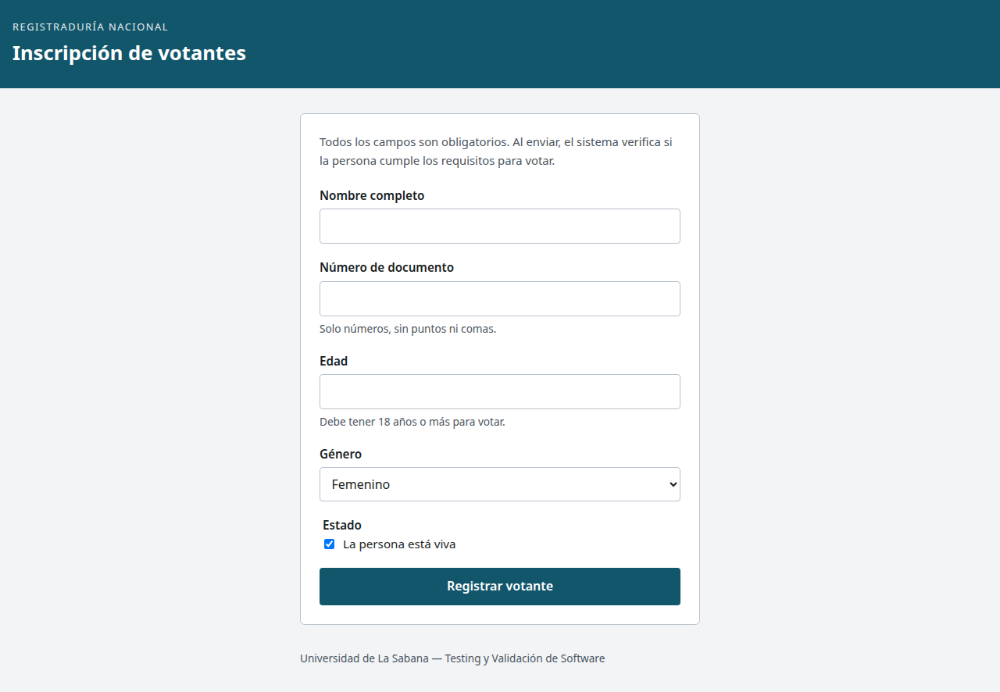
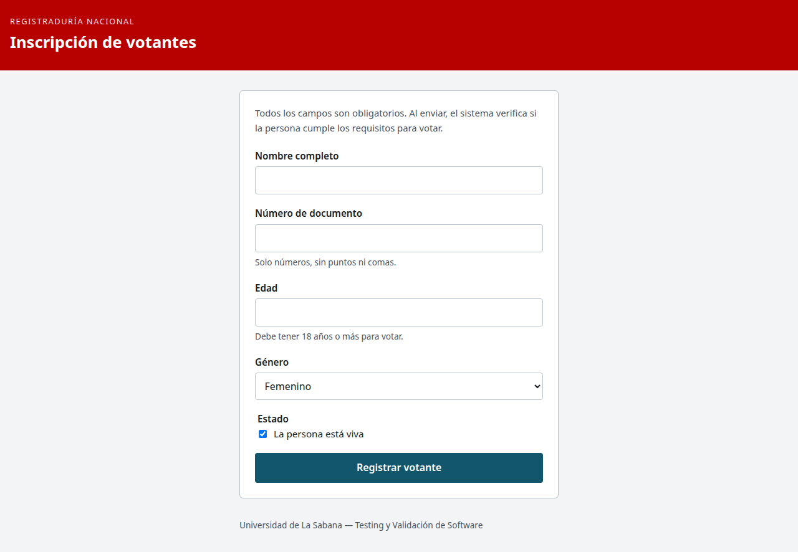
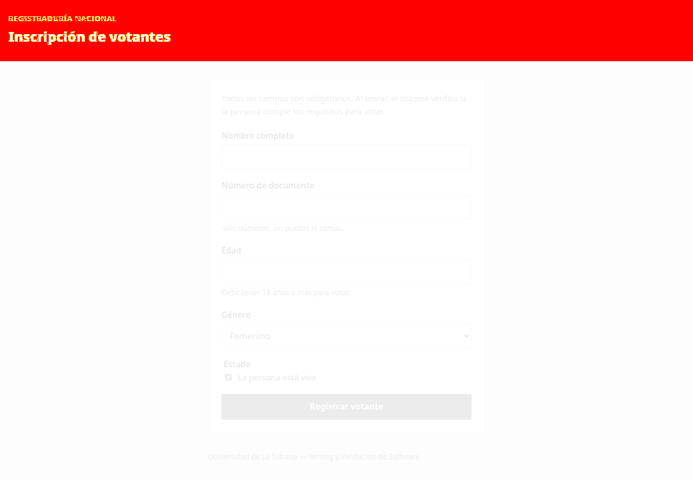

# Resultados técnicos de esta entrega

Ejecución local en Linux, con JDK 17.0.20, Maven 3.9.16, Node 22.22.3, Playwright 1.62.1, Chromium 151.0.7922.34 y axe-core 4.13.0. Las fechas UTC de los JSON corresponden a la noche del 3 de octubre de 2026 en Bogotá.

| Verificación | Resultado | Evidencia |
|---|---|---|
| Playwright completo | 40 pruebas correctas, sin fallos, omisiones ni reintentos | [Resumen](../evidencias/pruebas-resumen.json) |
| Independencia en paralelo | 52 ejecuciones correctas: 26 casos E2E × 2, con 4 workers y sin reintentos | [Resumen](../evidencias/independencia-resumen.json) |
| Java unitario | 4 pruebas, sin fallos, errores ni omisiones | [Surefire](../evidencias/java-unitarias-resumen.json) |
| Java integración | 1 prueba, sin fallos, errores ni omisiones | [Failsafe](../evidencias/java-integracion-resumen.json) |
| Selenium | 7 pruebas, sin fallos, errores ni omisiones | [Resumen](../evidencias/selenium-resumen.json) |
| Defectos antes de corregir | 3 casos fallidos: documento decimal, edad decimal y texto de ayuda | [Resumen previo](../evidencias/defectos-antes.json) |
| Regresión visual controlada | Fallo esperado: 140561 píxeles distintos, aproximadamente 13%, frente al umbral de 2% | [Resumen](../evidencias/regresion-resumen.json) |
| Clon limpio | 40 pruebas correctas desde una copia independiente, sin JAR previo | [Resumen](../evidencias/clon-limpio-resumen.json) |
| CI en GitHub | Ejecuciones y reportes disponibles en Actions | [Workflow](https://github.com/MarshallGomez1103/TYVS-Taller_Pruebas_de_UX/actions/workflows/ui-tests.yml) |
| Sesiones de usabilidad | 5 participantes; 20 éxitos reportados; SUS promedio 78,5 | [Informe](Usabilidad.md) |

## Regresión visual

La referencia se revisó visualmente. En el experimento aislado se interceptó la respuesta de `estilos.css` y se agregó `header { background: #b70000 !important; }`. La aplicación mantuvo su contenido funcional, pero su captura superó el mismo umbral de 2% de la prueba normal. El CSS del repositorio nunca cambió: al cerrar el contexto desapareció la intervención. Después se ejecutó la suite normal sin actualizar referencias.

| Referencia | Cambio temporal |
|---|---|
|  |  |

Las tres referencias de la entrega están en `playwright/tests/modulo4-visual.spec.js-snapshots/*-chromium-linux.png`. El formulario móvil se comprobó a 375 × 812 y sin desplazamiento horizontal.

## Límites del resultado

Las pruebas verdes no sustituyen a la sesión con personas ni a una auditoría manual completa. Las comprobaciones de teclado y regiones de anuncio no equivalen a una sesión con un lector de pantalla real. La independencia se sometió a ejecución paralela repetida; los documentos aleatorios minimizan las colisiones pero no ofrecen unicidad matemática absoluta.

La inspección del grupo C fue asistida y conserva evidencia de los estados del navegador. Los resultados de las sesiones son autorreportados y sus límites se documentan en Usabilidad. La corrida remota exacta se consulta en Actions. El módulo opcional de IA se conserva como material del profesor y no se presenta como ejecutado.
